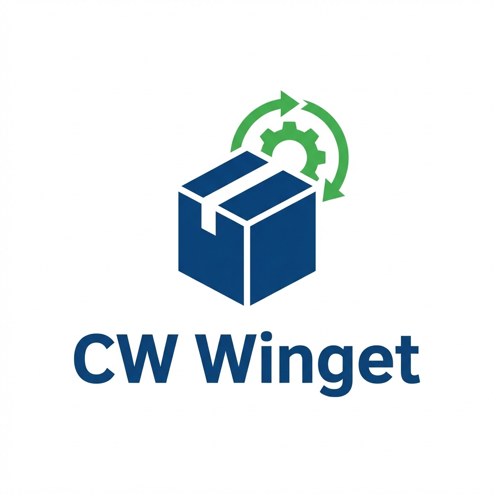
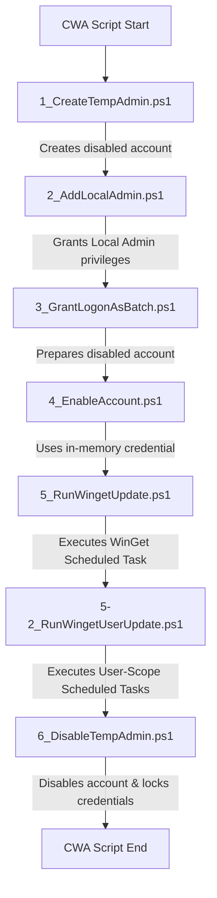

# <p align="center"><br>ConnectWise Automate WinGet Wrapper</p>

[](https://docs.microsoft.com/en-us/powershell/)
[](https://www.microsoft.com/windows)

A robust, enterprise-grade wrapper designed to integrate **Windows Package Manager (WinGet)** with **ConnectWise Automate (CWA)**. 

Because ConnectWise Automate scripts execute under the **SYSTEM** security context, native WinGet commands fail due to the lack of an interactive user profile. This wrapper solves the limitation by creating a temporary administrative user, executing WinGet via a dynamically cleaned Scheduled Task, and streaming real-time sanitised logs back to ConnectWise Automate. Its credential comes from the operating system cryptographic random-number generator, exists only inside the machine-update process, and is never returned to ConnectWise or passed to a child-process command line.

---

## 📖 Table of Contents
1. [Workflow Options](#-workflow-options)
2. [Architecture & Script Sequence](#%EF%B8%8F-architecture--script-sequence)
3. [Advanced Enterprise Features](#%EF%B8%8F-advanced-enterprise-features)
4. [ConnectWise Automate Configuration Steps](#-connectwise-automate-configuration-steps)
5. [Configuring Exclusions (Ignore List)](#-configuring-exclusions-ignore-list)
6. [Local Testing & Simulation](#-local-testing--simulation)
7. [Disclaimer](#-disclaimer)

---

## 🚀 Workflow Options

The repository is organized into two distinct production workflows:

### 1. Update All (`/update-all`)
* **Purpose**: Automatically discovers and upgrades **all** eligible applications currently installed on the target machine.
* **Scope**: Evaluates both system-wide and user-scope applications.
* **Exclusions**: Automatically respects your organizational ignore list.

### 2. Update Single App (`/update-single-app`)
* **Purpose**: Target, install, or update a **single specific application** using its unique WinGet Package ID (e.g., `Google.Chrome`, `Zoom.Zoom`).
* **Input**: Driven by the ConnectWise Automate script variable `@installapp@`.
* **Logic**: Verifies package availability in active WinGet sources before executing a silent installation.

---

## 🛠️ Architecture & Script Sequence

To bypass the SYSTEM profile restriction securely, the wrapper executes in a transaction-like sequence of steps. It passes only non-secret metadata using a delimited state token:

`Step|Username|Result[|SanitizedLogs]`



### Script Execution Roles:
1. **`1_CreateTempAdmin.ps1`**: Creates or rotates `TempAutomateAdmin` with a 32-character cryptographic password, then ensures the account is disabled. The password never leaves the process.
2. **`2_AddLocalAdmin.ps1`**: Adds the user to the local Administrators group using language-agnostic group SIDs.
3. **`3_GrantLogonAsBatch.ps1`**: Updates local security policy (`secedit`) to grant the account `SeBatchLogonRight` permissions.
4. **`4_EnableAccount.ps1`**: Compatibility step that verifies the account exists and remains disabled between independently executed CWA steps.
5. **`5_RunWingetUpdate.ps1`**: 
   - Rotates the password in memory, enables the account, and registers a transient elevated Scheduled Task.
   - Always unregisters the task, disables the account, and rotates the credential again—even on timeout or failure.
   - Cleans the WinGet cache, resets source repositories, pulls updates, parses available updates, applies exclusions, and runs upgrades.
6. **`5-2_RunWingetUserUpdate.ps1`**: 
   - Scans active interactive sessions (excluding system service accounts).
   - Dynamically registers user-level Scheduled Tasks running in the interactive user contexts to update user-profile scoped apps without triggering UAC prompts.
7. **`6_DisableTempAdmin.ps1`**: Defense-in-depth cleanup that disables `TempAutomateAdmin` even if a prior orchestration step was interrupted.

---

## 🛡️ Advanced Enterprise Features

### 🔌 Robust Account Management Fallback
To solve the fragility of the PowerShell `Microsoft.PowerShell.LocalAccounts` module under the **SYSTEM** context, account operations use layered fallbacks while keeping credentials away from observable command lines:
1. **Tier 1 (Modern Cmdlets)**: Utilizes native PowerShell cmdlets (`Get-LocalUser`, `New-LocalUser`, `Enable-LocalUser`, etc.) for modern, high-level execution.
2. **Tier 2 (ADSI WinNT Provider)**: Bypasses native wrappers to invoke .NET Active Directory Service Interfaces (`[ADSI]"WinNT://..."`) directly at the operating system API level, bypassing SAM-related cmdlet bugs.
3. **Tier 3 (Non-secret operations only)**: Legacy `net.exe` is retained for group membership and enable/disable compatibility. Passwords are never supplied to it because command-line arguments are observable by other local processes.

### 🌎 Global & Non-English OS Support
Standard scripts often fail on non-English Windows (e.g., German, Spanish, French) because system terms are localized. This wrapper uses deep Windows API compatibility:
* **SID-Based Group Resolution**: Rather than looking for `"Administrators"`, the script queries SID `S-1-5-32-544` to dynamically identify the local administrators group (resolving seamlessly to `Administratoren`, `Administradores`, etc.).
* **SID-Based Service Exclusions**: Excludes service accounts during interactive user scanning by translating account handles to well-known SIDs (`S-1-5-18` for SYSTEM, `S-1-5-19` for Local Service, and `S-1-5-20` for Network Service). This prevents schedules from attempting to run under non-interactive system service accounts regardless of OS translation.
* **Space-Based Package ID Parsing**: On non-English Windows, WinGet outputs localized summary rows (e.g., `"1 Aktualisierung verfügbar."`). The upgrade parser checks if the extracted Package ID contains spaces. Since all valid WinGet Package IDs are single-word strings (e.g. `Microsoft.Edge`), any localized metadata lines are automatically and safely ignored.

### 🧹 Premium Task Scheduler Hygiene
* **Guaranteed Unregistration**: `Unregister-ScheduledTask` is located inside the script's `finally` blocks. No matter what occurs (successful run, timeout, script abort, or unexpected exception), the temporary scheduled task is guaranteed to be deleted.
* **Active Timeout Handling**: If a WinGet process deadlocks or hangs (e.g., waiting for an unhandled network prompt), the monitoring loop detects the timeout threshold and actively calls `Stop-ScheduledTask` to kill the backend thread on the OS before unregistering the task.

### 🔒 Unicode-Safe Log Sanitization
To prevent ConnectWise Automate preprocessor and SQL injection vulnerabilities, logs are sanitized before return:
* Accented letters and language diacritics (e.g., `ä, ö, ü, ß, ñ, á, ç, è`) are preserved using Unicode regex groups (`\p{L}` and `\p{N}`).
* Dangerous injection symbols, such as single quotes (`'`), double quotes (`"`), backticks (`` ` ``), semicolons (`;`), and pipes (`|`), are safely removed, protecting your CWA database and scripts from parsing failures.

### 🚀 Resilient Silent Installation Engine
To address background install hangs (such as Thunderbird setup waiting for user response in Session 0) and service lockout failures (like Google Chrome / Adobe Reader failing with MSI error 1601), a premium silent installation engine has been integrated inside `5_RunWingetUpdate.ps1`:
* **MSI Database Lock Resolution**: Proactively terminates any hung background `msiexec.exe` processes to clear pending installer locks before initiating installations.
* **Windows Installer Service Activation**: Pre-emptively configures the Windows Installer Service (`msiserver`) to Manual startup type and starts it to ensure standard MSI installers do not fail with error 1601 (Service Unavailable).
* **Non-Interactive GUI Suppression**: Every command executes with strict `--silent --disable-interactivity --scope machine` parameters to enforce silent execution and completely block UAC, setup wizard GUI displays, or interactive license prompts.
* **Per-Package 10-Minute Timeout Monitor**: Executes each app update through a custom background process monitor (`Invoke-WingetCommand`). If a setup hangs or becomes unresponsive for longer than **10 minutes (600 seconds)**, the engine:
  - Actively stops the primary `winget` process.
  - Recursively terminates all descendant child installer processes (using dynamic WMI/CIM process-tree traversal) to guarantee a clean state.
  - Logs a warning message and safely moves to the next application, ensuring the entire automation wrapper does not hang.

---

## ⚙️ ConnectWise Automate Configuration Steps

To deploy this in your ConnectWise Automate control center, follow these steps:

### Step A: Create CWA Variables
Create a script in CWA and define the following variables in the **Variables** tab or within the script context:
* `WingetState`: Used to pass the token value from step to step.
* `installapp` *(Only needed for update-single-app workflow)*: Set this to the exact WinGet ID of the app you wish to install/update (e.g., `Zoom.Zoom`).

### Step B: Construct CWA Script Steps
Replicate the script execution sequence. For each step, use CWA's **Execute PowerShell** function:

1. **Step 1: Create Temp Admin**
   * **Script File**: `1_CreateTempAdmin.ps1`
   * **Run Context**: SYSTEM
   * **Store Output In**: `%WingetState%`
2. **Step 2: Add Local Admin**
   * **Script File**: `2_AddLocalAdmin.ps1`
   * **Parameters / Injected State**: Set state parameter using `'%WingetState%'`
   * **Run Context**: SYSTEM
   * **Store Output In**: `%WingetState%`
3. **Step 3: Grant Logon As Batch**
   * **Script File**: `3_GrantLogonAsBatch.ps1`
   * **Parameters / Injected State**: Set state parameter using `'%WingetState%'`
   * **Run Context**: SYSTEM
   * **Store Output In**: `%WingetState%`
4. **Step 4: Prepare Disabled Account**
   * **Script File**: `4_EnableAccount.ps1`
   * **Parameters / Injected State**: Set state parameter using `'%WingetState%'`
   * **Run Context**: SYSTEM
   * **Store Output In**: `%WingetState%`
5. **Step 5: Run WinGet Update**
   * **Script File**: `5_RunWingetUpdate.ps1`
   * **Parameters / Injected State**: Set state parameter using `'%WingetState%'` (and inject `%installapp%` for single app)
   * **Run Context**: SYSTEM (This script registers the task that executes as `TempAutomateAdmin`)
   * **Store Output In**: `%WingetState%`
6. **Step 5-2: Run User-Scoped Update**
   * **Script File**: `5-2_RunWingetUserUpdate.ps1`
   * **Parameters / Injected State**: Set state parameter using `'%WingetState%'`
   * **Run Context**: SYSTEM (Registers task that runs in active user session)
   * **Store Output In**: `%WingetState%`
7. **Step 6: Disable Temp Admin & Cleanup**
   * **Script File**: `6_DisableTempAdmin.ps1`
   * **Parameters / Injected State**: Set state parameter using `'%WingetState%'`
   * **Run Context**: SYSTEM
   * **Store Output In**: `%WingetState%`

> [!IMPORTANT]
> Always wrap the `@state@` or `%WingetState%` placeholder in single quotes (`'`) within your script templates. This preserves security delimiters and prevents PowerShell from expanding internal variables during script initialization.

---

## 🚫 Configuring Exclusions (Ignore List)

You can exclude specific applications from being updated automatically during the `update-all` or `update-single-app` workflows (for example, pinned legacy line-of-business applications).

* **Path**: Create or append to a plain text file at:
  `C:\Windows\LTSvc\eworx\winget\ignoredprograms.txt`
* **Format**: List one application name or WinGet Package ID per line.
* **Match Style**: Case-insensitive substring matching. If any part of the App Name or App ID matches a row in `ignoredprograms.txt`, the application is skipped.

### Example `ignoredprograms.txt`:
```text
Java
Mozilla.Firefox
ClassicShell
```

---

## 🧪 Local Testing & Simulation

You can safely test the entire end-to-end multi-step workflow locally on a test machine without ConnectWise Automate by using the master simulation script:

1. Open PowerShell **as Administrator**.
2. Navigate to either workflow directory (`/update-all` or `/update-single-app`).
3. Execute the simulation runner:
   ```powershell
   Set-ExecutionPolicy Bypass -Scope Process -Force
   .\Run-WingetAutomated.ps1
   ```
4. The simulation script will sequentially execute the steps, inject the states, execute the Scheduled Tasks, display the sanitized real-time logs, and cleanly disable the temporary admin account upon completion.

---

## ⚖️ Disclaimer

This project is an independent community project. It is not affiliated with, endorsed by, or sponsored by ConnectWise. ConnectWise Automate® is a registered trademark of ConnectWise, LLC. All scripts and information are provided "as is" without warranty of any kind.
